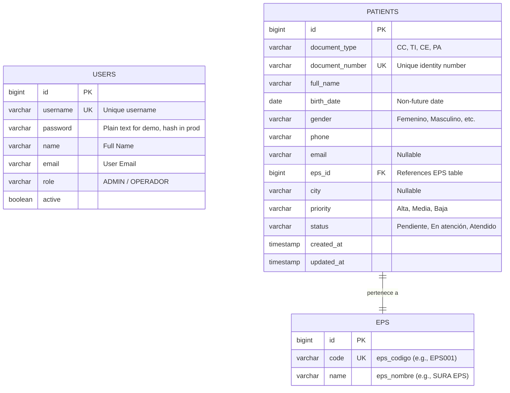

# GoEcosystem - Digital Health (Prueba Técnica Full Stack 2026)

Este repositorio contiene la solución a la **Prueba Técnica Desarrollador Full Stack (2026)** para GoEcosystem. Consiste en una aplicación modular diseñada para gestionar la lista de espera de pacientes en una clínica (IPS), permitiendo identificar prioridades, actualizar estados de atención y visualizar estadísticas operativas en tiempo real.

---

## 🚀 Arquitectura y Tecnologías

El proyecto se divide en dos componentes principales:

### Backend

- **Tecnología:** Java 17 + Spring Boot 4.x
- **Acceso a Datos:** Spring Data JPA + Hibernate
- **Base de Datos:** PostgreSQL
- **Librerías de Ingesta:** Apache POI (para parsing automático del archivo Excel)
- **Seguridad:** Autenticación básica y emisión de tokens basada en credenciales.

### Frontend

- **Tecnología:** Vue 3 (Options API) + Vite
- **Diseño e Interfaz:** Vuetify 3 (Material Design con personalización de tema oscuro y Glassmorphism)
- **Íconos:** Material Design Icons (`@mdi/font`)
- **Cliente HTTP:** Axios (con interceptores para adjuntar de forma automática el token de autenticación)
- **Enrutamiento:** Vue Router (con Navigation Guards para proteger rutas privadas)

---

## 📊 Modelo de Datos

A continuación se muestra la representación lógica de las tablas creadas en la base de datos PostgreSQL:



---

## 🔑 Credenciales de Demostración

El sistema inicializa automáticamente dos cuentas de usuario para pruebas (extraídas de la hoja `Usuarios_Login` del Excel):

| Rol               | Usuario         | Contraseña  | Nota            |
| :---------------- | :-------------- | :---------- | :-------------- |
| **Administrador** | `admin.demo`    | `Demo2026*` | Acceso completo |
| **Operador**      | `operador.demo` | `Demo2026*` | Acceso estándar |

---

## ⚙️ Requisitos e Instalación

### Requisitos Previos

- **Java Development Kit (JDK):** Versión 17 o superior.
- **Node.js:** Versión 22.x o superior.
- **PostgreSQL:** Instalado y ejecutándose localmente.

---

### Paso 1: Configurar la Base de Datos

1. Abre tu cliente de PostgreSQL (pgAdmin, DBeaver, psql, etc.).
2. Crea una base de datos vacía llamada `prueba_db`:
   ```sql
   CREATE DATABASE prueba_db;
   ```
3. Si utilizas credenciales de conexión distintas a las por defecto (`postgres` / `postgres`), abre el archivo del backend [application.properties](backend/src/main/resources/application.properties) y edita las siguientes líneas:
   ```properties
   spring.datasource.url=jdbc:postgresql://localhost:5432/prueba_db
   spring.datasource.username=tu_usuario
   spring.datasource.password=tu_contrasenha
   ```

---

### Paso 2: Ejecutar el Backend (Spring Boot)

1. Abre una terminal en la carpeta `/backend`:
   ```bash
   cd backend
   ```
2. Compila y ejecuta el servidor de Spring Boot:
   ```bash
   ./mvnw spring-boot:run
   ```
3. **Carga de Datos Automática:** Al arrancar el servidor por primera vez, el sistema detectará que la base de datos está vacía e importará automáticamente:
   - El catálogo de las 10 EPS.
   - Los 2 usuarios de demostración.
   - Los 1,000 registros sintéticos de pacientes contenidos en el archivo Excel `Datos_Sinteticos_Prueba_Full_Stack_Junior_2026.xlsx`.

---

### Paso 3: Ejecutar el Frontend (Vue 3)

1. Abre una nueva terminal en la carpeta `/frontend`:
   ```bash
   cd frontend
   ```
2. Instala las dependencias necesarias:
   ```bash
   npm install
   ```
3. Inicia el servidor de desarrollo de Vite:
   ```bash
   npm run dev
   ```
4. Abre tu navegador en la ruta indicada por consola (típicamente `http://localhost:5173`).

---

## 🛠️ Decisiones de Diseño y Arquitectura

- **Carga Automática de Datos (Seed):** Se implementó `CommandLineRunner` en la clase `ExcelDataLoader` para poblar la base de datos al arrancar. Esto elimina la necesidad de ejecutar scripts SQL manuales, haciendo que la prueba sea 100% autoejecutable.
- **Consultas de Búsqueda y Paginación:** El backend procesa las búsquedas y filtrados mediante consultas JPQL eficientes en `PatientRepository` de forma paginada (`Pageable`), lo que permite manipular los 1,000 registros sintéticos sin comprometer la velocidad ni la memoria del cliente.
- **Enrutamiento y Layout con Vuetify:** Se implementó una arquitectura de rutas anidadas con `MainLayout.vue` para separar la vista de login (libre de menús) del panel interno de gestión. Esto resolvió problemas asíncronos en los offsets de pantalla del motor de diseño de Vuetify 3.

---

## ⚠️ Limitaciones Conocidas (Fase Demo)

- **Almacenamiento de Contraseñas:** En esta versión de evaluación, las contraseñas se almacenan y validan en texto plano (conforme a los datos provistos en el Excel). En un entorno productivo, se debe incorporar hashing con BCrypt/PBKDF2.
- **Token de Autenticación:** Se utiliza un token UUID simulado emitido por el endpoint `/auth/login`. Para ambientes de producción, se debe estructurar un JWT firmado con expiración.
